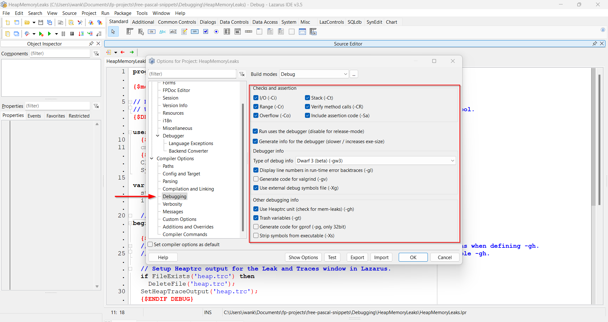

# Debugging

!!! Important 

    The official docs by Michaël Van Canneyt and Florian Klämpfl on debugging; [Debugging your Program](https://www.freepascal.org/docs-html/user/userch10.html).

## Setup Debug and Release build profiles

### Using the default configuration

1. Open a new project in Lazarus IDE
2. Go to **Project | Options | Compiler Options**
3. In the Build modes (by default says default) click the `...` button.
4. In the **Build Mode** window, click **Create Debug and Release modes** button.

Once you've done that, you will see two new profiles; `Debug` and `Release`.

!!! Important

    Use the `Debug` profile for debugging and detecting heap memory leaks.

    Use `Release` for production.

### Create additional build profiles

See this page; [https://wiki.lazarus.freepascal.org/IDE_Window:__Compiler_Options#Build_modes](https://wiki.lazarus.freepascal.org/IDE_Window:__Compiler_Options#Build_modes)

## Where are the debug switches?

1. Press ++ctrl+shift+f11++ to open **Project Options** window.
2. Choosing **Debugging** from the left hand side menu will reveal more switches as shown below.

## What if I run without setting up Debug and Release build profiles?

When you run a code first time using the default build mode, you will see the following dialogue box.

Hit the **Ok** button for now, but remember to [setup your build profiles](#setup-debug-and-release-build-profiles) later.
