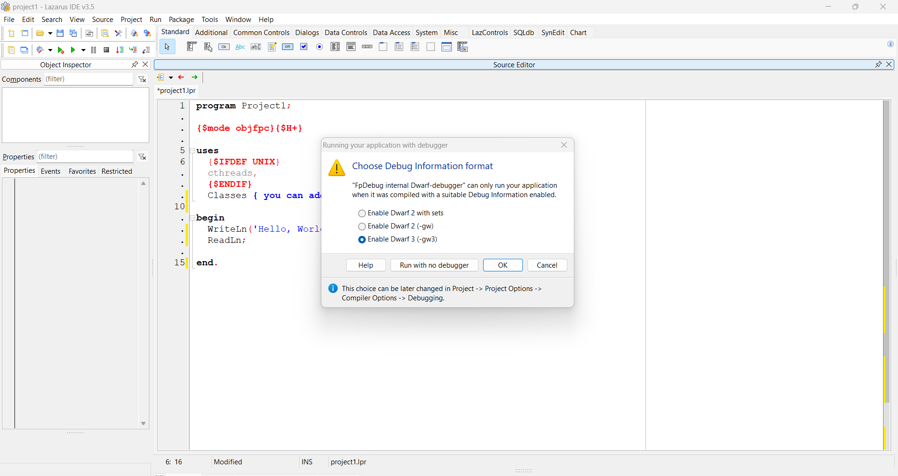

# Debugging

## Official docs on debugging Free Pascal programs

Here is the official docs by Michaël Van Canneyt and Florian Klämpfl; [Debugging your Program](https://www.freepascal.org/docs-html/user/userch10.html).

## Create Debug and Release profiles in Lazarus

1. Open a new project in Lazarus IDE
2. Go to **Project | Options | Compiler Options**
3. In the Build modes (by default says default) click the `...` button.
4. In the **Build Mode** window, click **Create Debug and Release modes** buttion.

Once you've done that, you will see two new profiles; `Debug` and `Release`.

Use the `Debug` profile if you need to detect heap memory leaks.

Use `Release` for production.

## Debugger to use in Lazarus IDE



Citing from [https://wiki.lazarus.freepascal.org/DWARF](https://wiki.lazarus.freepascal.org/DWARF)

> ==For GDB "DWARFv2 with sets" is the best option==. Testing shows that, if using other (v3 and up) DWARF (as generated by FPC) then GDB is more likely to crash.
> 
> debugger may not be able to distinguish between PChar and AnsiString
> All identifiers (e.g. field-names) returned by the debugger are upper-cased
> ... other diffs
> 
> DWARF 2 (the one **without** "with sets") does not display sets "type TMySet = set of (v1,v2,v3)" correctly.

## Detecting heap memory leaks

Consider using the pre-defined Debug mode from [Create Debug and Release profiles in Lazarus](#create-debug-and-release-profiles-in-lazarus) before customising your own debugging environment.

### Official docs on using Heaptrc

- [HeapTrc Usage](https://www.freepascal.org/docs-html/rtl/heaptrc/usage.html)
- [RTL - `heaptrc`](https://www.freepascal.org/docs-html/rtl/heaptrc/index.html)
- [RTL - `SetHeapTraceOutput`](https://www.freepascal.org/docs-html/rtl/heaptrc/setheaptraceoutput.html)
- [Controlling HeapTrc with environment variables](https://www.freepascal.org/docs-html/rtl/heaptrc/environment.html)
- [Wiki - Using Heaptrc in FPC](https://wiki.freepascal.org/heaptrc)
- [Wiki - Using LeakView in Lazarus](https://wiki.freepascal.org/leakview)

### Detecting heap memory leaks in Lazarus

There two ways of accomplishing this;

- use the default Debug mode or
- enable the HeapTrc manually.

#### Enable the default Debug mode

Once you've created the default Debug and Release profiles in Lazarus, switch to Debug Mode to see heap memopry leaks.

Steps:

- Press ++ctrl+shift+f11++ to open the **Project Options** window.
- Go to **Compilation and Linking**.
- Set **Build modes** to **Release**.
- Re-compile your program.

#### Manually enable HeapTrc

First, go to `Project | Project Options ...` 

In the Options window find `Compiler Options | Debugging`, then enable the following switches.

- **[Mandatory]** `Use Heaptrc unit (check for mem-leaks) (-gh)`
- **[Optional]** `Display line numbers in run-time errors backtraces (-gl)`

Click the image below to expand the view.


Now, save leaks report to a file use [`SetHeapTraceOutput`](https://www.freepascal.org/docs-html/rtl/heaptrc/setheaptraceoutput.html) to redirect heap trace report to a file.

Here is an example.

1. Define a `DEBUG` symbol. We contain the heap trace report only for debug builds. Line 7.

      - FYI, the `{$DEFINE}` directive has a command-line equivalent, `-d`.  For example, `-dNAME`

2. Create a conditional compilation block for `DEBUG` builds, `{$IFDEF DEBUG}...{$ENDIF DEBUG}`, for redirecting heap trace to a file. Line 23-31.

      - Remove existing heap trace file. Line 28, 29.
      - Set a file for reporting heap memory leaks. Line 30.

```pascal linenums="1" hl_lines="7 23-31"
program HeapMemoryLeakLazarus;

{$mode objfpc}{$H+}{$J-}

// Define a symbol name DEBUG.
// With this compiler directives we can compile parts of code associated with this symbol.
{$DEFINE DEBUG}

uses
  {$IFDEF UNIX}
  cmem, cthreads,
  {$ENDIF}
  Classes,
  SysUtils;

var
  stringList: TStringList;
  i: integer;

  // MAIN block
begin

  {$IFDEF DEBUG}
  // This block assumes your build mode sets -dDEBUG in `Project Options` or other means when defining -gh.
  // For production build, remove -dDEBUG in `Project Options` or other means and disable -gh.

  // Setup Heaptrc output for the Leak and Traces window in Lazarus.
  if FileExists('heap.trc') then
    DeleteFile('heap.trc');
  SetHeapTraceOutput('heap.trc');
  {$ENDIF DEBUG}

  // Create a string list
  stringList := TStringList.Create;

  try
    // Adding items
    WriteLn('Adding items');
    WriteLn('--------------------');
    for i := 0 to 4 do
      stringList.Add('Counting ' + IntToStr(i));

    // Printing contents
    for i:=0 to stringList.Count - 1 do
      WriteLn(stringList[i]);

  finally
    // If you don't free, the -gh will give report of memory leaks
    // If Leak and Traces window is set to a heap trace file, this will appear in the Leak and Traces windoww.
    // Otherwise, Heaptrc will print heap memory reports on CLI.
    stringList.Free;
  end;

  // Pause Console
  WriteLn('Press Enter key to quit.');
  ReadLn;
end.
```

After you run the program, you will get a heap trace report file.

**3. View Leaks & Traces**

1. Click `View` form the top menu bar of Lazarus IDE.
2. Select `Leaks and Traces`
3. Set the `.trc` file to read by pressing the `...` (elipsis) button.
4. Click the **Update** button to reload latest changes to the `.trc` file.

Click the image below to expand the view.


Now, whenever you run the program in DEBUG mode from Lazarus IDE, simply press the **Update** button on the **Leaks and Traces** window to see the latest heap memory report.

If there is any leaks in the program, pressing the **Update** button will show leaking memory size, leaking blocks counts and the details of leaking blocks.

Click the image below to expand the view.

