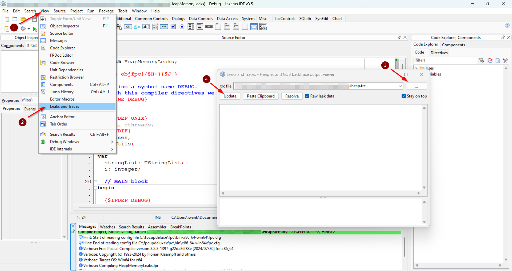

# Finding heap memory leaks

Consider using the pre-defined Debug mode from [Create Debug and Release profiles in Lazarus](#create-debug-and-release-profiles-in-lazarus) before customising your own debugging environment.

!!! Note "Official docs on Heaptrc"

    - [HeapTrc Usage](https://www.freepascal.org/docs-html/rtl/heaptrc/usage.html)
    - [RTL - `heaptrc`](https://www.freepascal.org/docs-html/rtl/heaptrc/index.html)
    - [RTL - `SetHeapTraceOutput`](https://www.freepascal.org/docs-html/rtl/heaptrc/setheaptraceoutput.html)
    - [Controlling HeapTrc with environment variables](https://www.freepascal.org/docs-html/rtl/heaptrc/environment.html)
    - [Wiki - Using Heaptrc in FPC](https://wiki.freepascal.org/heaptrc)
    - [Wiki - Using LeakView in Lazarus](https://wiki.freepascal.org/leakview)

## 1. Enable the default Debug mode

Once you've created the default Debug and Release profiles in Lazarus, switch to Debug Mode to see heap memopry leaks.

Steps:

- Press ++ctrl+shift+f11++ to open the **Project Options** window.
- Go to **Compilation and Linking**.
- Set **Build modes** to **Debug**.
- Re-compile your program.

## 2. Or manually enable `HeapTrc`.

First, go to `Project | Project Options ...` 

In the Options window find `Compiler Options | Debugging`, then enable the following switches.

- **[Mandatory]** `Use Heaptrc unit (check for mem-leaks) (-gh)`
- **[Optional]** `Display line numbers in run-time errors backtraces (-gl)`

Click the image below to expand the view.


## 3. (Optional) Save leaks report to a file

Use [`SetHeapTraceOutput`](https://www.freepascal.org/docs-html/rtl/heaptrc/setheaptraceoutput.html) to redirect heap trace report to a file.


## 4. Example - Redirect leaks report to a file

1. Enable Debug mode for compilation.
2. Define a `DEBUG` symbol. We contain the heap trace report only for debug builds. Line 7.

      - FYI, the `{$DEFINE}` directive has a command-line equivalent, `-d`.  For example, `-dNAME`

3. Create a conditional compilation block for `DEBUG` builds, `{$IFDEF DEBUG}...{$ENDIF DEBUG}`, for redirecting heap trace to a file. Line 23-31.

      - Remove existing heap trace file. Line 28, 29.
      - Set a file for reporting heap memory leaks. Line 30.

```pascal linenums="1" hl_lines="7 23-31"
program HeapMemoryLeakLazarus;

{$mode objfpc}{$H+}{$J-}

// Define a symbol name DEBUG.
// With this compiler directives we can compile parts of code associated with this symbol.
{$DEFINE DEBUG}

uses
  {$IFDEF UNIX}
  cmem, cthreads,
  {$ENDIF}
  Classes,
  SysUtils;

var
  stringList: TStringList;
  i: integer;

  // MAIN block
begin

  {$IFDEF DEBUG}
  // This block assumes your build mode sets -dDEBUG in `Project Options` or other means when defining -gh.
  // For production build, remove -dDEBUG in `Project Options` or other means and disable -gh.

  // Setup Heaptrc output for the Leak and Traces window in Lazarus.
  if FileExists('heap.trc') then
    DeleteFile('heap.trc');
  SetHeapTraceOutput('heap.trc');
  {$ENDIF DEBUG}

  // Create a string list
  stringList := TStringList.Create;

  try
    // Adding items
    WriteLn('Adding items');
    WriteLn('--------------------');
    for i := 0 to 4 do
      stringList.Add('Counting ' + IntToStr(i));

    // Printing contents
    for i:=0 to stringList.Count - 1 do
      WriteLn(stringList[i]);

  finally
    // If you don't free, the -gh will give report of memory leaks
    // If Leak and Traces window is set to a heap trace file, this will appear in the Leak and Traces windoww.
    // Otherwise, Heaptrc will print heap memory reports on CLI.
    // stringList.Free;
  end;

  // Pause Console
  WriteLn('Press Enter key to quit.');
  ReadLn;
end.
```

The program prints the following on the screen.

```bash
$ ./HeapMemoryLeak.exe
Adding items
--------------------
Counting 0
Counting 1
Counting 2
Counting 3
$
```

You will get a heap trace report file containing a report similar to the one below; showing 6 unfreed memory blocks - 348 bytes. 

```bash
$ cat heap.trc
/a-long-path/HeapMemoryLeak.exe
Heap dump by heaptrc unit of /a-long-path/HeapMemoryLeak.exe
134 memory blocks allocated : 5089/5480
128 memory blocks freed     : 4741/5112
6 unfreed memory blocks : 348
True heap size : 229376 (192 used in System startup)
True free heap : 227520
Should be : 227664
Call trace for block $00000000000B12C0 size 35
  $000000010000BA32
  $00000001000051C3
  $00000001000060AB
  $00000001000055ED
  $000000010000197F  $main,  line 41 of HeapMemoryLeak.lpr
  $0000000100001B16  $main,  line 53 of HeapMemoryLeak.lpr
  $00000001000111C0
  $00000001000017A0
  $00007FFA4CC0257D
  $00007FFA4DF6AF28
  $BAADF00DBAADF00D
  $BAADF00DBAADF00D
  $BAADF00DBAADF00D
  $BAADF00DBAADF00D
  $BAADF00DBAADF00D
  $BAADF00DBAADF00D
Call trace for block $00000000000B11C0 size 35
  $000000010000BA32
  $00000001000051C3
  $00000001000060AB
  $00000001000055ED
  $000000010000197F  $main,  line 41 of HeapMemoryLeak.lpr
  $0000000100001B16  $main,  line 53 of HeapMemoryLeak.lpr
  $00000001000111C0
  $00000001000017A0
  $00007FFA4CC0257D
  $00007FFA4DF6AF28
  $BAADF00DBAADF00D
  $BAADF00DBAADF00D
  $BAADF00DBAADF00D
  $BAADF00DBAADF00D
  $BAADF00DBAADF00D
  $BAADF00DBAADF00D
Call trace for block $00000000000B10C0 size 35
  $000000010000BA32
  $00000001000051C3
  $00000001000060AB
  $00000001000055ED
  $000000010000197F  $main,  line 41 of HeapMemoryLeak.lpr
  $0000000100001B16  $main,  line 53 of HeapMemoryLeak.lpr
  $00000001000111C0
  $00000001000017A0
  $00007FFA4CC0257D
  $00007FFA4DF6AF28
  $BAADF00DBAADF00D
  $BAADF00DBAADF00D
  $BAADF00DBAADF00D
  $BAADF00DBAADF00D
  $BAADF00DBAADF00D
  $BAADF00DBAADF00D
Call trace for block $00000000000B5BB0 size 64
  $000000010000BA32
  $000000010001C18E
  $000000010001BBEC
  $000000010001BEC4
  $000000010001BE84
  $000000010001C456
  $00000001000019BA
  $0000000100001B16  $main,  line 53 of HeapMemoryLeak.lpr
  $00000001000111C0
  $00000001000017A0
  $00007FFA4CC0257D
  $00007FFA4DF6AF28
  $BAADF00DBAADF00D
  $BAADF00DBAADF00D
  $BAADF00DBAADF00D
  $BAADF00DBAADF00D
Call trace for block $00000000000B0FC0 size 35
  $000000010000BA32
  $00000001000051C3
  $00000001000060AB
  $00000001000055ED
  $000000010000197F  $main,  line 41 of HeapMemoryLeak.lpr
  $0000000100001B16  $main,  line 53 of HeapMemoryLeak.lpr
  $00000001000111C0
  $00000001000017A0
  $00007FFA4CC0257D
  $00007FFA4DF6AF28
  $BAADF00DBAADF00D
  $BAADF00DBAADF00D
  $BAADF00DBAADF00D
  $BAADF00DBAADF00D
  $BAADF00DBAADF00D
  $BAADF00DBAADF00D
Call trace for block $00000000000D5910 size 144
  $000000010000BA32
  $00000001000090BA
  $000000010001C2F5
  $000000010000188D
  $0000000100001B16  $main,  line 53 of HeapMemoryLeak.lpr
  $00000001000111C0
  $00000001000017A0
  $00007FFA4CC0257D
  $00007FFA4DF6AF28
  $BAADF00DBAADF00D
  $BAADF00DBAADF00D
  $BAADF00DBAADF00D
  $BAADF00DBAADF00D
  $BAADF00DBAADF00D
  $BAADF00DBAADF00D
  $BAADF00DBAADF00D
```

## 5. (Optional) View Leaks & Traces in Lazarus IDE

1. Click `View` form the top menu bar of Lazarus IDE.
2. Select `Leaks and Traces`
3. Set the `.trc` file to read by pressing the `...` (elipsis) button.
4. Click the **Update** button to reload latest changes to the `.trc` file.

Click the image below to expand the view.



Now, whenever you run the program in DEBUG mode from Lazarus IDE, simply press the **Update** button on the **Leaks and Traces** window to see the latest heap memory report.

If there is any leaks in the program, pressing the **Update** button will show leaking memory size, leaking blocks counts and the details of leaking blocks.

Click the image below to expand the view.

