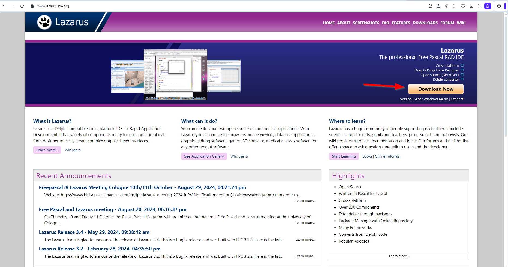
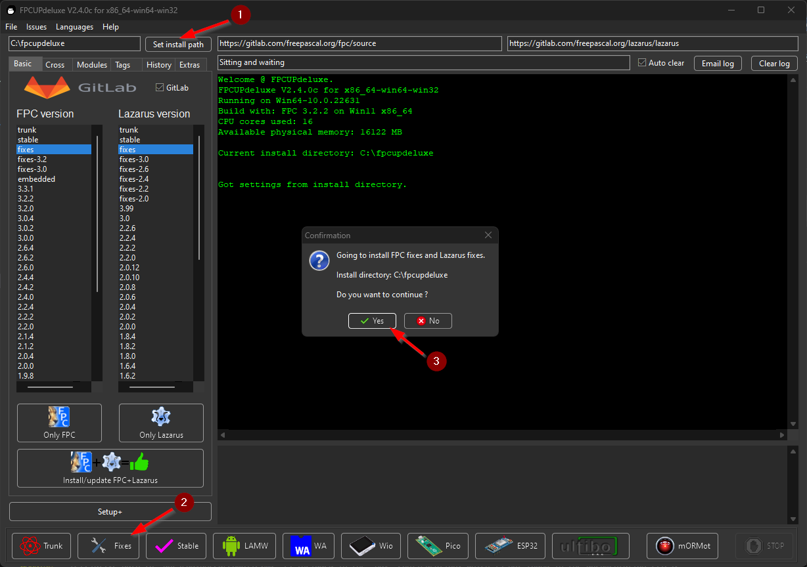
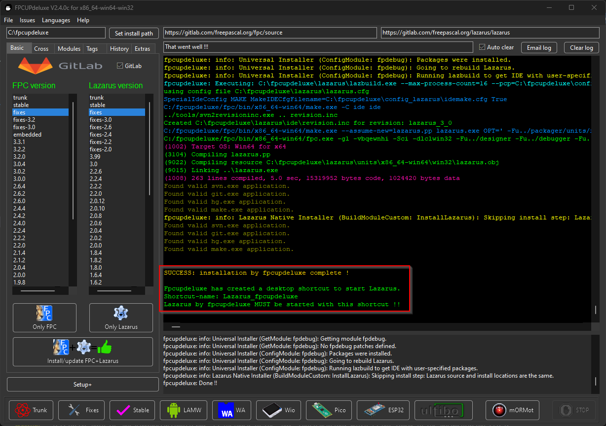
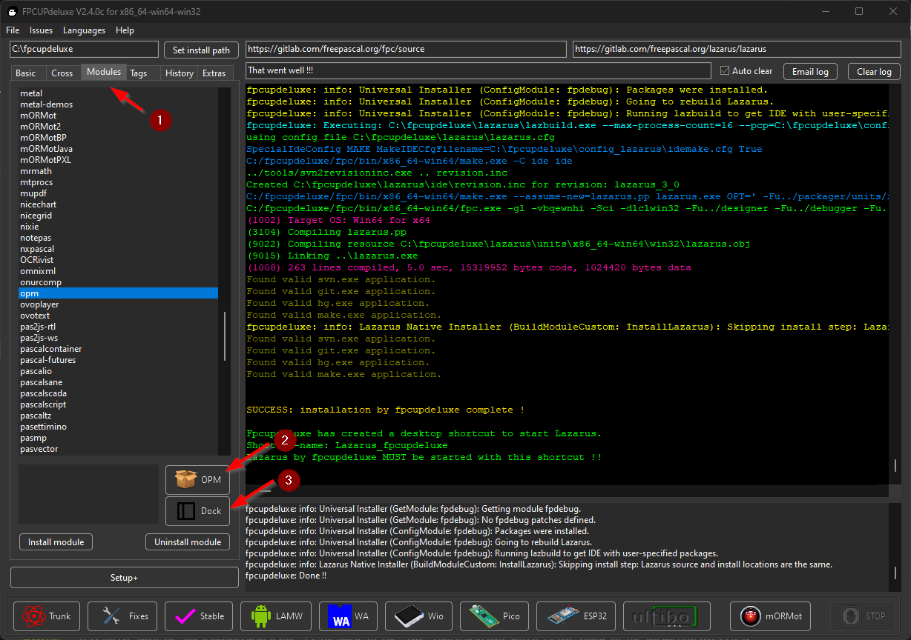
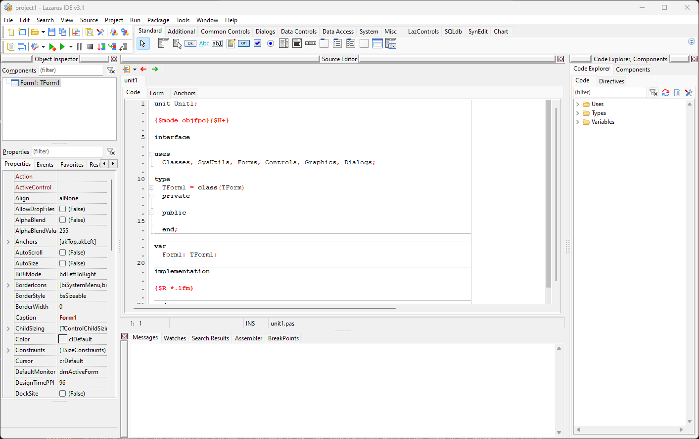

# Setup Lazarus IDE and FPC

Here are two easy ways to set up Lazarus IDE and Free Pascal Compiler (FPC) on your system.

- [Use Lazarus IDE's Installer (easiest)](#use-lazarus-ides-installer-easiest)
- [Use `fpcupdeluxe` (more options)](#use-fpcupdeluxe-more-options)

## Use Lazarus IDE's Installer (easiest)

1. Head to [https://www.lazarus-ide.org](https://www.lazarus-ide.org).

2. Click the **Download** button to get an installer for your OS




## Use `fpcupdeluxe` (more options)


### Install on Windows

#### Get the installer

1. Head to [https://github.com/LongDirtyAnimAlf/fpcupdeluxe/releases](https://github.com/LongDirtyAnimAlf/fpcupdeluxe/releases)
2. Download the latest `fpcupdeluxe` for your OS and architecture, and save it in a new folder.
3. Run `fpcupdeluxe`.

#### Get latest fixes

Steps.

1. Set installation path.
2. Click the **Fixes** button.
3. Click **Yes** when the confirmation box appears. 



The installtion of FPC and Lazarus might take a while. Sit back and relax.

Once succesfully installed, the console will let you know a shortcut to Lazarus IDE is available on the Windows desktop.

```
SUCCESS: installation by fpcupdeluxe complete !

Fpcupdeluxe has created a desktop shortcut to start Lazarus.
Shortcut-name: Lazarus_fpcupdeluxe
Lazarus by fpcupdeluxe MUST be started with this shortcut !!
```



#### Add recommended modules

There are two more recommended modules to install.

- With the **Online Package Manager (OPM)**, you can easily install online packages right within the Lazarus IDE.
- The **Dock (anchordocking)** module turns the Lazarus IDE into a one-window setup.

Steps.

1. Click on the **Modules** tab.
2. Click on the **OPM** button. Click yes when the confirmation box appears. Wait until the installation is completed before moving to the last step.
3. Click on the **Dock** button. Click yes when the confirmation box appears.



Once the installation is completed succesfully, close `fcpupdeluxe`.

#### Launch Lazarus IDE

At the end of the installation, you will find `Lazarus_fcpupdeluxe` on your desktop.

Double click to run it. You will see Lazarus IDE as shown below.




### Install on Linux or macOS

Consult the [`fpcupdeluxe` github page](https://github.com/LongDirtyAnimAlf/fpcupdeluxe).


