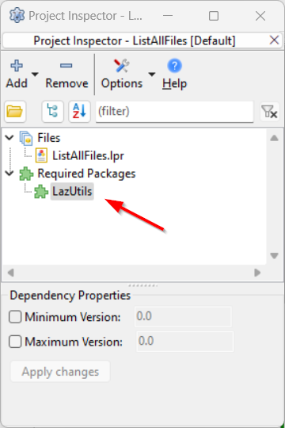

# Directories, Path and Filename

## Get home directory of current user

Use [`GetUserDir`](https://www.freepascal.org/docs-html/rtl/sysutils/getuserdir.html) from `SysUtils` unit.

1. Add `SysUtils` in the uses section.
2. Call `GetUserDir`.

```pascal linenums="1" hl_lines="10 18"
program GetHomeDir;

{$mode objfpc}{$H+}{$J-}

uses
  {$IFDEF UNIX}
  cthreads,
  {$ENDIF}
  Classes,
  SysUtils;

var
  homeDir: string;

begin

  // Get home dir
  homeDir := GetUserDir;

  WriteLn('THe home directory is ', homeDir);

  // Pause console
  WriteLn('Press enter to quit ...');
  ReadLn;
end.
```

## Create a directory or chain of directories

Here is a snippet of creating a sub directory called `demo/ex-01` in the program's current directory.

```pascal linenums="1" hl_lines="15"
program DirPathFileCreateDir;

{$mode objfpc}{$H+}{$J-}

uses
  {$IFDEF UNIX}
  cthreads,
  {$ENDIF}
  Classes, SysUtils;

var
  directoryName: string;
begin
  directoryName := ConcatPaths(['demo','ex-01']);
  if ForceDirectories(directoryName) then
    WriteLn('Directory created successfully')
  else
    WriteLn('Failed to create directory');
end.
```

## Create a directory or chain of directories with UTF8

You can use `ForceDirectories` to create directories with UTF8.

Here is a snippet of creating a sub directory called `demo/胜利` in the program's current directory.

```pascal linenums="1" hl_lines="15"
program DirPathFileCreateDirUTF8;

{$mode objfpc}{$H+}{$J-}

uses
  {$IFDEF UNIX}
  cthreads,
  {$ENDIF}
  Classes, 
  SysUtils;

var
  directoryName: string;
begin
  directoryName := ConcatPaths(['demo','胜利']);
  if ForceDirectories(directoryName) then
    WriteLn('Directory created successfully')
  else
    WriteLn('Failed to create directory');
end.
```

## Check if a directory exists

Use `FileExists` from unit `SysUtils`.

```Pascal linenums="1" hl_lines="10 14"
program CheckDirExists;

{$mode objfpc}{$H+}{$J-}

uses
  {$IFDEF UNIX}
  cthreads,
  {$ENDIF}
  Classes,
  SysUtils;

begin

  if (DirectoryExists('sub-folder/')) then
    WriteLn('That folder exists!')
  else
    WriteLn('Can''t find it!');

  // Pause console
  ReadLn;

end.
```

## Check if a file exists

Use `FileExists` from unit `SysUtils`.

```pascal linenums="1" hl_lines="4 12"
program CheckFileExists;

uses
  SysUtils;

var
  fileName: String;

begin
  fileName := 'hello-world.txt';

  if FileExists(fileName) then
    Writeln( fileName, ' exists.')
  else
    Writeln(fileName, ' does not exist.');
end.
```

## Find a file type in a folder (FindFirst)

Here is an example searching for `*.csv` files using [`FindFirst`](https://www.freepascal.org/docs-html/3.2.2/rtl/sysutils/findfirst.html).

1. Add `SysUtils` in uses section. Line 10.
2. Call `FindFirst` with 3 arguments. Line 21.
   
      - Path and a wildcard pattern.
      - Attribute, use `faAnyFile`.
      - Outpt TSearchRec variable to store results.

3. If `FindFirst` returns 0, loop using `repeat ... until FindNext(searchResult) <> 0`. Line 23 to 31.
4. Lastly, free resources relating to `FindFirst` and `FindNext` using `FindClose`. Line 39.

```pascal linenums="1" hl_lines="10 21 23-31 38"
program FindFirstSearch;

{$mode objfpc}{$H+}

uses
  {$IFDEF UNIX}
  cthreads,
  {$ENDIF}
  Classes,
  SysUtils;

var
  searchRec: TSearchRec;
  path: string = './sub-folder/';
  criteria: string = '*.csv';
  Count: integer = 0; // Optional, only if you need a count

begin

  // Call FindFirst, requires 3 arguments
  if FindFirst(path + criteria, faAnyFile, searchRec) = 0 then
  begin
    repeat
      if (searchRec.Name <> '.') and (searchRec.Name <> '..') and (searchRec.Attr <> faDirectory) then
      begin
        // Optional, only if you need a count -- increase a counter
        Inc(Count);
        // Display files found by FindFirst
        WriteLn(searchRec.Name);
      end;
    until FindNext(searchRec) <> 0;

    // A successful FindFirst call must always be followed by a FindClose call
    // with the same TSearchRec record. Failure to do so will result in memory leaks.
    // If the findfirst call failed (i.e. returned a nonzero handle) there is
    // no need to call FindClose.
    // See https://www.freepascal.org/docs-html/3.2.2/rtl/sysutils/findfirst.html
    FindClose(searchRec);
  end;

  // Display count of matching files
  WriteLn(Format('Found %d files matching %s', [Count, criteria]));

  // Pause console
  WriteLn;
  WriteLn('Press Enter key to quit');
  ReadLn;
end.
```

**References**

- [https://www.freepascal.org/docs-html/3.2.2/rtl/sysutils/findfirst.html](https://www.freepascal.org/docs-html/3.2.2/rtl/sysutils/findfirst.html).
- [https://www.freepascal.org/docs-html/3.2.2/rtl/sysutils/findnext.html](https://www.freepascal.org/docs-html/3.2.2/rtl/sysutils/findnext.html)
- [https://www.freepascal.org/docs-html/3.2.2/rtl/sysutils/findclose.html](https://www.freepascal.org/docs-html/3.2.2/rtl/sysutils/findclose.html)


## Find multiple file types in a folder (FindFirst)

See the snippet below, which looks for `*.csv` and `*.txt` files.

I added `IsFileNameMatching` to match `searchRec.Name` against a regex experssion. Line 13-34.

1. When calling `FindFirst` use `*` or `*.*`. The Regex will do the filtering. Line 44.
2. In the `repeat ... until FindNext(searchRec) <> 0` loop, simply match `searchRec.Name` against a regular expression. That's it. Line 49.
3. Call `FindClose` to release resources used by `FindFirst` and `FindNext`. Line 59. 

```pascal linenums="1" hl_lines="13-34 44 49 59"
program FindFirstSearchRegex;

{$mode objfpc}{$H+}

uses
  {$IFDEF UNIX}
  cthreads,
  {$ENDIF}
  Classes,
  SysUtils,
  RegExpr;

  // A function for matching filename against a regex pattern
  function IsFileNameMatching(const fileName: string; const regexPattern: string): boolean;
  var
    regex: TRegExpr;
  begin
    regex := TRegExpr.Create;
    try
      // Set the regex to case-insensitive
      regex.ModifierI := True;
      // Apply the regex pattern
      regex.Expression := regexPattern;

      // Check for a match
      if regex.Exec(filename) then
        Result := True
      else
        Result := False;
    finally
      // Free TRegExpr
      regex.Free;
    end;
  end;

var
  searchRec: TSearchRec;
  path: string = './sub-folder/';
  regexExpression: string = '(.csv|.txt)';
  Count: integer = 0; // Optional, only if you need a count

begin
  // Call FindFirst, append *.* to path
  if FindFirst(path + '*.*', faAnyFile, searchRec) = 0 then
  begin
    repeat
      if (searchRec.Name <> '.') and (searchRec.Name <> '..') and (searchRec.Attr <> faDirectory) then
      begin
        if IsFileNameMatching(searchRec.Name, regexExpression) then
        begin
          // Optional, only if you need a count -- increase a counter
          Inc(Count);
          // Display files found by FindFirst
          WriteLn(searchRec.Name);
        end;
      end;
    until FindNext(searchRec) <> 0;
    // MUST FREE RESOURCES relating to FindFirst and FindNext
    FindClose(searchRec);
  end;

  // Display count of matching files
  WriteLn(Format('Found %d files matching %s', [Count, regexExpression]));

  // Pause console
  WriteLn;
  WriteLn('Press Enter key to quit');
  ReadLn;
end.
```

## Find a file type in a folder and store in an array (FindFirst)

It is pretty straightforward. 

See the snippet below that looks for `*.csv` in a folder and store the names of `*.csv`  files in an `array of string`.

1. Add `SysUtils` in the uses. Line 10.
2. Call the `FindFirst`. Line 22.
3. Store files found into an array in the in the `repeat ... until FindNext(searchRec) <> 0` loop. Line 27-32.

      - Set the new length of the array.
      - Assign the `searchRec.Name` into the new index.
      - Increment counter to set the new length in the next loop.

4. Lastly, free resources relating to `FindFirst` and `FindNext` using `FindClose`. Line 36.

```pascal linenums="1" hl_lines="10 22 27-32 36"
program FindFirstSearchStoreArray;

{$mode objfpc}{$H+}

uses
  {$IFDEF UNIX}
  cthreads,
  {$ENDIF}
  Classes,
  SysUtils;

var
  searchRec: TSearchRec;
  path: string = './sub-folder/';
  criteria: string = '*.csv';
  filesFound: array of string;
  fileCount: integer = 0;
  i: integer;

begin
  // Call FindFirst, append wildcard pattern to path
  if FindFirst(path + criteria, faAnyFile, searchRec) = 0 then
  begin
    repeat
      if (searchRec.Name <> '.') and (searchRec.Name <> '..') and (searchRec.Attr <> faDirectory) then
      begin
        // Set length the array of string
        SetLength(filesFound, fileCount + 1);
        // Add file name from searchRec into this array
        filesFound[fileCount] := searchRec.Name;
        // Increment file counter
        Inc(fileCount);
      end;
    until FindNext(searchRec) <> 0;
    // MUST RELEASE RESOURCES relating to FindFirst and FindNext
    FindClose(searchRec);
  end;

  // Display count of matching files
  WriteLn(Format('Found %d files matching %s', [Length(filesFound), criteria]));

  // Display all files
  for i := 0 to High(filesFound) do WriteLn(filesFound[i]);

  // Pause console
  WriteLn;
  WriteLn('Press Enter key to quit');
  ReadLn;
end.
```


## Find multiple file types and store in an array (FindFirst)

Straightforwrd, simply by extending from the previous snippet we can achieve this.

1. When calling `FindFirst` use `*` or `*.*`. The Regex will do the filtering. Line 46.
2. Do `SetLength` and add `searchRec.Name` into array if `IsFileNameMatching(searchRec.Name, regexExpression)` returns `True`. Line 53-63.
3. Call `FindClose(searchRec)` at the end of `FindNext(searchRec)` to avoid memory leaks. Line 67.

```pascal linenums="1" hl_lines="46 53-63 67"
program FindFirstSearchRegexStoreInArray;

{$mode objfpc}{$H+}{$J-}

uses
  {$IFDEF UNIX}
  cthreads,
  {$ENDIF}
  Classes,
  SysUtils,
  RegExpr;

  // A function for matching filename against a regex pattern
  function IsFileNameMatching(const fileName: string; const regexPattern: string): boolean;
  var
    regex: TRegExpr;
  begin
    regex := TRegExpr.Create;
    try
      // Set the regex to case-insensitive
      regex.ModifierI := True;
      // Apply the regex pattern
      regex.Expression := regexPattern;

      // Check for a match
      if regex.Exec(filename) then
        Result := True
      else
        Result := False;
    finally
      // Free TRegExpr
      regex.Free;
    end;
  end;

var
  searchRec: TSearchRec;
  path: string = './sub-folder/';
  regexExpression: string = '(.csv|.txt)';
  filesFound:array of string;
  fileCount: integer = 0;
  i: integer;

begin
  // Call FindFirst, append *.* to path
  if FindFirst(path + '*.*', faAnyFile, searchRec) = 0 then
  begin
    repeat
      // Skipping `.`, `..` and directories
      if (searchRec.Name <> '.') and (searchRec.Name <> '..') and (searchRec.Attr <> faDirectory) then
      begin
        // Matching result against a regex expression
        if IsFileNameMatching(searchRec.Name, regexExpression) then
        begin
          // Set length the array of string
          SetLength(filesFound, fileCount + 1);
          // Add file name from searchRec into this array
          filesFound[fileCount] := searchRec.Name;
          // Increment file counter
          Inc(fileCount);
          // Display files found by FindFirst
          WriteLn(searchRec.Name);
        end;
      end;
    until FindNext(searchRec) <> 0;
    // MUST FREE RESOURCES relating to FindFirst and FindNext
    FindClose(searchRec);
  end;

  // Display count of matching files
  WriteLn(Format('Found %d files matching %s', [Length(filesFound), regexExpression]));

  // Pause console
  WriteLn;
  WriteLn('Press Enter key to quit');
  ReadLn;
end.
```


## Find multiple file types recursively (FindFirst)

See an example below, using `TRegExpr` and `FindFirst`.

It may seem complicated, however, the algorithm in `SearchFiles` is pretty straightforward.

1. Call `FindFirst` using `*` or `*.*`. The Regex will do the filtering.
2. In the `repeat ... until FindNext(searchResult) <> 0` loop;

    - Check if the current `searchRec.name` it is a folder. 
        - If yes, call this function, along with the name of the found folder, `path + searchRec.Name`.
        - If not, use `IsFileNameMatching` to match filename against a regex expression.

3. Lastly, call `FindClose(searchRec)`.

```pascal linenums="1" hl_lines="36-64 72"
program FindFirstSearchRecursive;

{$mode objfpc}{$H+}{$J-}

uses
  {$IFDEF UNIX}
  cthreads,
  {$ENDIF}
  Classes,
  SysUtils,
  RegExpr;

  // A function for matching filename against a regex pattern
  function IsFileNameMatching(const fileName: string; const regexPattern: string): boolean;
  var
    regex: TRegExpr;
  begin
    regex := TRegExpr.Create;
    try
      // Set the regex to case-insensitive
      regex.ModifierI := True;
      // Apply the regex pattern
      regex.Expression := regexPattern;

      // Check for a match
      if regex.Exec(filename) then
        Result := True
      else
        Result := False;
    finally
      // Free TRegExpr
      regex.Free;
    end;
  end;

  // A recursive search function using FindFirst and Regex
  procedure SearchFiles(const path: string; const regexPattern: string);
  var
    searchRec: TSearchRec;
  begin
    if FindFirst(path + '*.*', faAnyFile, searchRec) = 0 then
    begin
      repeat
        if (searchRec.Name <> '.') and (searchRec.Name <> '..') then
        begin
          // If searchRec.Name is a directory, then call this function recursively
          if (searchRec.Attr and faDirectory) = faDirectory then
          begin
            // If found a directory, perform search on that directory
            SearchFiles(path + searchRec.Name + PathDelim, regexPattern);
          end
          else
            // If searchRec.Name is not a directory, check if the file matches regex pattern
          begin
            if IsFileNameMatching(path + searchRec.Name, regexPattern) then
              // If it matches regex expression, display name
              WriteLn(path + searchRec.Name);
          end;
        end;
      until FindNext(searchRec) <> 0;
      // MUST RELEASE resources relating to FindFirst and FindNext
      FindClose(searchRec);
    end;
  end;

var
  path: string = './sub-folder/';
  regexPattern: string = '(.csv|.xlsx)';

begin
  // Display files in a path, recursively, using a regex pattern
  SearchFiles(path, regexPattern);

  // Pause Console
  WriteLn('Press Enter key to Exit');
  ReadLn;
end.
```


## Find multiple file types recursively (LazUtils package - The most straightforward of all)

You can use [FindAllFiles](https://lazarus-ccr.sourceforge.io/docs/lazutils/fileutil/findallfiles.html) from `FileUtil` unit.

To use this unit, you must add `LazUtils` package from the `Project Inspector -> Required Packages`.



Here is an example. This program looks for `csv` and `xslx` files in a sub-folder.

1. Add `FileUtil` in the uses section.
2. Invoke the `FindAllFiles` and save the output into a `TStringList` variable. You don't need to instantiate the `TStringList` object separately; `FindAllFiles` handles it automatically. When calling this function, make sure to provide the following:

      - The path to be searched.
      - The types of files to be searched.
      - Specify whether the search should be recursive.
  
3. Lastly, free the `TStringList`.

```pascal linenums="1" hl_lines="10 23 34"
program ListAllFiles;

{$mode objfpc}{$H+}{$J-}

uses
  {$IFDEF UNIX}
  cthreads,
  {$ENDIF}
  Classes,
  FileUtil, // Add LazUtils in Project Inspector -> Required Packages first
  SysUtils;

var
  searchResults: TStringList;
  path: string = './sub-folder/';
  criteria: string = '*.csv;*.xlsx';
  isRecursive: boolean = True;
  item: string;

begin

  // Call FindAllFiles, no need to create TStringList manually
  searchResults := FindAllFiles(path, criteria, isRecursive);
  try
    // Print number of files found
    WriteLn(Format('Found %d files', [searchResults.Count]));

    // Display results, if any
    if searchResults.Count > 0 then
      for item in searchResults do WriteLn(item);

  finally
    // Free the TStringList
    searchResults.Free;
  end;

  // Pause console
  WriteLn;
  WriteLn('Press Enter key to exit ...');
  ReadLn;
end.
```

**References**

- [https://lazarus-ccr.sourceforge.io/docs/lazutils/fileutil/findallfiles.html](https://lazarus-ccr.sourceforge.io/docs/lazutils/fileutil/findallfiles.html)
- [https://www.tweaking4all.com/forum/delphi-lazarus-free-pascal/lazarus-find-all-files-in-a-directory-and-subdirectories-matching-criteria/](https://www.tweaking4all.com/forum/delphi-lazarus-free-pascal/lazarus-find-all-files-in-a-directory-and-subdirectories-matching-criteria/)