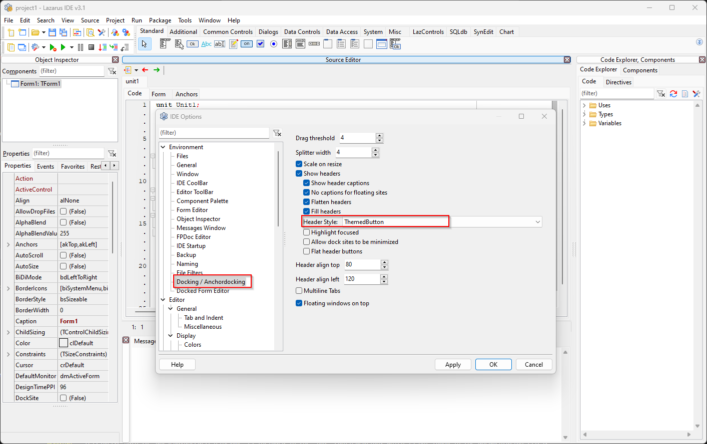
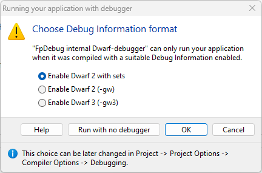

# Post-Install

## Change the header style of the panels

1. Go to **Tool -> Options ...**.
2. Click on **Docking/Achordocking** item on the left side and set a **Header Style** (see the screenshot below).

Hit the **Apply** button to see how the **Header Style** looks on the IDE.

Hit the **OK** button to save the settings.

## Prevent the caret from moving past end of line

1. Go to **Tools -> Options ... -> Editor (left hand side)**
2. Uncheck **Allow caret to move past the end of line**.

## Show hint and completion boxes sooner

1. Go to **Tools -> Options ... -> Editor (left hand side)**
2. Set shorter values for 
      - **Delay for Delay for completion box** 
      - **Delay for hints**.

## Format code

Hit ++ctrl+d++ on the code window.

## Setup a debugger in Lazarus

Citing from [https://wiki.lazarus.freepascal.org/DWARF](https://wiki.lazarus.freepascal.org/DWARF)

> ==For GDB "DWARFv2 with sets" is the best option==. Testing shows that, if using other (v3 and up) DWARF (as generated by FPC) then GDB is more likely to crash.
> 
> debugger may not be able to distinguish between PChar and AnsiString
> All identifiers (e.g. field-names) returned by the debugger are upper-cased
> ... other diffs
> 
> DWARF 2 (the one **without** "with sets") does not display sets "type TMySet = set of (v1,v2,v3)" correctly.

## Compile and run

You have choices. Pick one.

1. Use ++f9++ to compile (as necessary) and run *with the debugger*. The debugger notifies of any exceptions in a pop-up.

2. Use ++shift+ctrl+f9++ to compile (as necessary) and run *without the debugger*.

3. Use ++ctrl+f9++ if you'd like to compile without running it in the IDE. You will run the executable manually via a CLI.